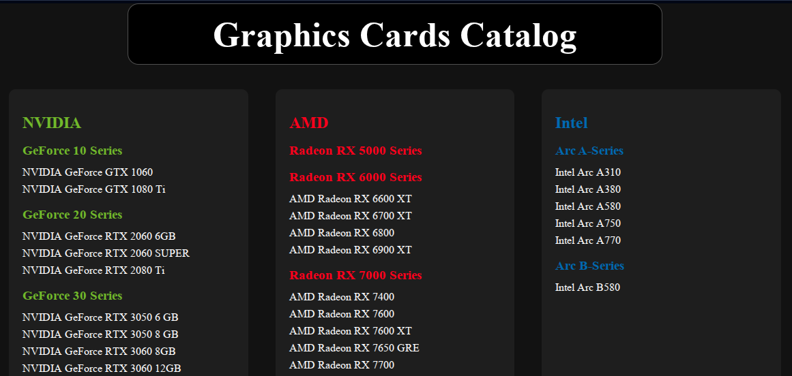
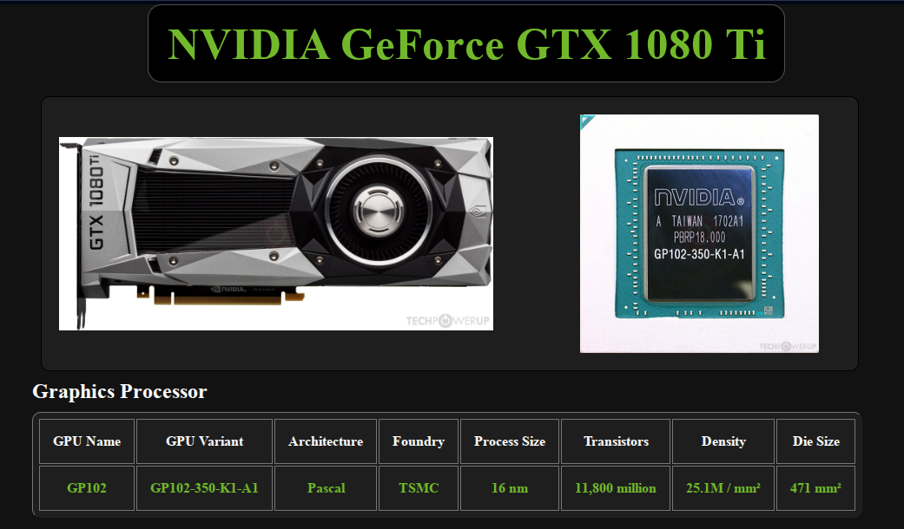

# Graphics Cards Catalog

## Table of Contents
- [About](#about)
- [Usage](#usage)
- [Docker](#docker)


## About

A web app to display detailed information for all of your favorite graphics cards.

Build using **Node.js + Express** (Backend) and **React + Axios** (Frontend).

- [Live demo⇗](https://gpu-catalog.onrender.com) on Render.

- Available on the Docker Hub
  ```bash
  docker pull rafaeltorok/gpucatalog:latest
  ```

- See the [Docker](#docker) section for instructions on how to run the container.

### Screenshots




## Usage

### Development mode
- Start the backend server
  ```bash
  cd ./server && npm install && npm run dev
  ```

- Start the client
  ```bash
  cd ./client && npm install && npm run dev
  ```

- Access the Web UI on http://localhost:5173

- HTTP GET requests to http://localhost:3001/api/gpus

### Production mode
- Start the server
  ```bash
  cd ./server && npm install && npm run dev
  ```

- Access the Web Ui on http://localhost:3001

- HTTP GET requests to http://localhost:3001/api/gpus


## Docker
Build the image
```bash
cd ./server && docker build -t gpucatalog .
```

Run the container
```bash
docker run --name gpucatalog -p 3001:3001 gpucatalog
```
